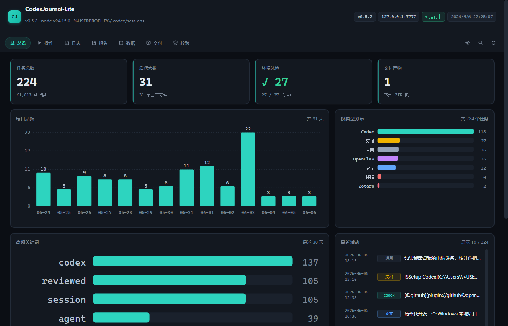
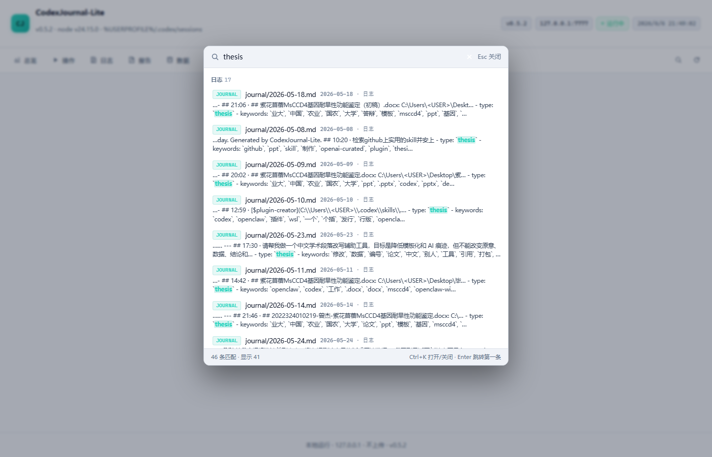
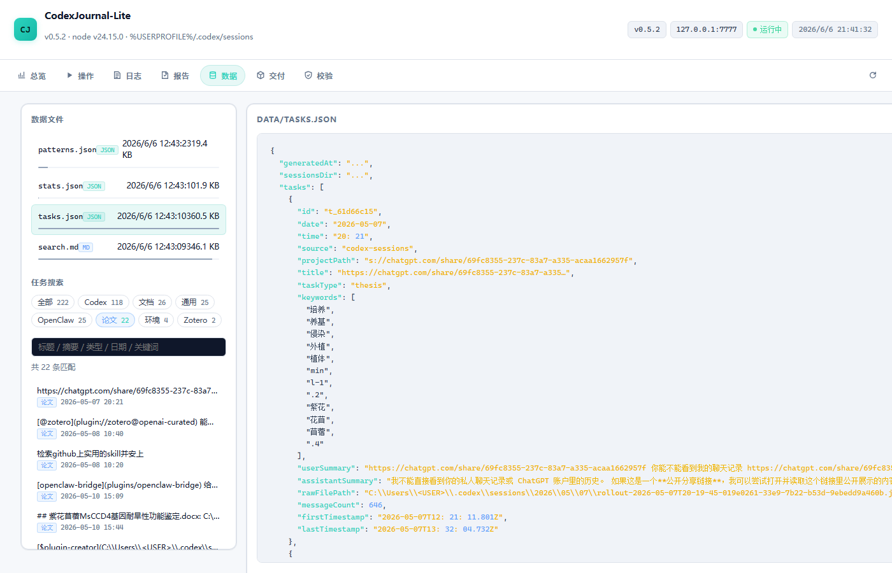
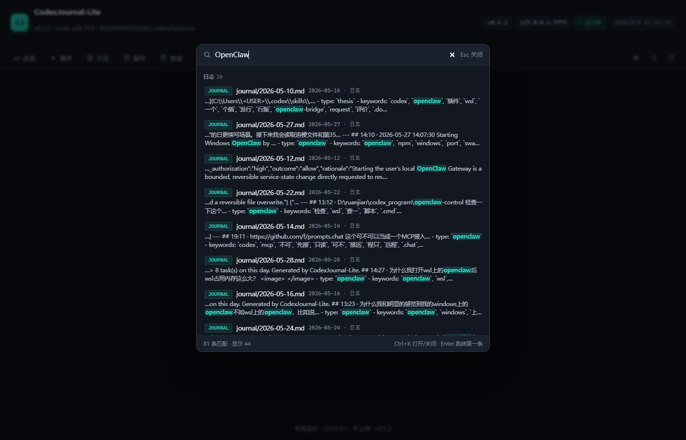

# CodexJournal-Lite

[](https://github.com/jiezeng2004-design/CodexJournal-Lite/actions/workflows/ci.yml)
[](LICENSE)
[](package.json)
[](package.json)

Turn scattered Codex sessions into a searchable local work memory — without uploading anything.

It reads local Codex session logs, writes Markdown and JSON summaries inside
this project directory, and does not upload data, call external services, or
use third-party npm packages.

The project is designed for developers who want a lightweight, inspectable,
offline way to review their AI-assisted coding sessions: what was worked on,
when it happened, which projects were involved, and what outputs were created.

## What It Does

- Archives Codex sessions into `journal/YYYY-MM-DD.md`.
- Writes structured task records to `data/tasks.json`.
- Builds a full-text search file at `data/search.md`.
- Produces local reports such as `reports/dashboard.md`,
  `reports/work-patterns.md`, monthly summaries, yearly summaries, and output
  indexes.
- Provides a localhost-only dashboard at `http://127.0.0.1:7777/`.
- Includes an offline fixture test for the IDEA / JetBrains log inventory
  probe.

## Screenshots

| Dashboard | Search |
| --- | --- |
|  |  |

| Data filter | Dark search |
| --- | --- |
|  |  |

## Privacy Model

- No telemetry.
- No upload.
- No network calls for archive, analysis, verification, or the dashboard.
- No external npm dependencies.
- Generated personal outputs are gitignored by default:
  `data/*`, `journal/*`, `reports/*`, and `dist/*`.
- `data/index.json` is a local fingerprint cache and must never be committed.

See [docs/privacy.md](docs/privacy.md) for the detailed privacy contract.
See [docs/usage.md](docs/usage.md) for a step-by-step usage guide.
See [docs/project-summary.md](docs/project-summary.md) for a reviewer-friendly
project overview.

## Requirements

- Windows PowerShell for the bundled scripts.
- Node.js 18 or newer.
- Codex session files under `%USERPROFILE%\.codex\sessions`, or a custom
  session path configured in `config.json`.

## Install From A Fresh Clone

```powershell
# Windows PowerShell
git clone https://github.com/jiezeng2004-design/CodexJournal-Lite.git
cd CodexJournal-Lite
npm.cmd run verify:fresh
```

There are no npm dependencies to install. The project uses Node.js built-ins
and PowerShell scripts only.

## Quick Start

```powershell
# Windows PowerShell, from the project root
npm.cmd run check
npm.cmd run archive
npm.cmd run summarize
npm.cmd run console
```

Then open:

```text
http://127.0.0.1:7777/
```

Generated outputs stay inside the clone:

- `journal/YYYY-MM-DD.md`
- `data/tasks.json`
- `data/search.md`
- `data/stats.json`
- `reports/dashboard.md`
- `reports/work-patterns.md`

## Common Commands

```powershell
# Windows PowerShell, from the project root
npm.cmd run check         # verify Node, config, source dir, and output dirs
npm.cmd run archive       # build journal/, data/tasks.json, data/search.md, reports/dashboard.md
npm.cmd run build-index   # rebuild data/index.json only
npm.cmd run stats         # regenerate data/stats.json
npm.cmd run scan:sources  # inventory IDEA / JetBrains AI-related logs
npm.cmd run test:sources  # run offline fixture tests
npm.cmd run summarize     # build work-pattern reports from data/tasks.json
npm.cmd run doctor        # check expected project/output structure
npm.cmd run index:outputs # write reports/output-index.md and .json
npm.cmd run package:local # create a local handoff zip in dist/
npm.cmd run package:public  # create a public release zip in dist/ (source + docs only)
npm.cmd run verify:public-zip # validate public release zip contents
npm.cmd run verify:fresh   # verify a fresh clone with no personal archive data
npm.cmd run verify         # full local verification gate
```

## Packaging for Release

Two packaging commands serve different purposes:

| Command | Output | Contents | Use for |
| --- | --- | --- | --- |
| `npm run package:local` | `dist/CodexJournal-Lite-v*-local.zip` | Source + your generated archive data | Personal backup / handoff |
| `npm run package:public` | `dist/CodexJournal-Lite-v*-public.zip` | Source + docs + fixtures only | **GitHub Releases** |

**`npm run package:local` is for local handoff only and may include your generated
personal outputs (`data/tasks.json`, `journal/*.md`, `reports/*.md`, etc.).**
**Do not upload local handoff packages to GitHub Releases.**

Use `npm run package:public` for any public-facing release artifact — it
excludes all generated personal data and contains only source code,
documentation, and test fixtures.

## Release Packaging

Public release packages are generated automatically by GitHub Actions when a
version tag such as `v0.6.2` is pushed.

The release workflow builds:

- `CodexJournal-Lite-v<version>-public.zip`
- `CodexJournal-Lite-v<version>-public.zip.sha256`

The public ZIP is verified before upload. It must not contain `.git/`,
`node_modules/`, `.env`, generated journals, task records, local reports, cache
files, or nested ZIP files.

For local manual verification:

```powershell
npm.cmd run package:public
npm.cmd run verify:public-zip
```

Do not upload local handoff packages to GitHub Releases.

## npm Package

npm package publishing is planned but not yet available. The project is
currently distributed as a GitHub repository. Clone and run locally:

```powershell
git clone https://github.com/jiezeng2004-design/CodexJournal-Lite.git
cd CodexJournal-Lite
npm.cmd run verify:fresh
```

## Project Layout

```text
CodexJournal-Lite/
  console/       Localhost dashboard, no external dependencies
  data/          Generated task records and indexes, gitignored
  dist/          Local zip packages, gitignored
  docs/          Privacy, source, and analysis documentation
  journal/       Generated daily Markdown journal, gitignored
  reports/       Generated reports and logs, gitignored
  scripts/       PowerShell helper scripts
  src/           Node.js CLI implementation
  test-fixtures/ Offline fixture data for tests
  config.json    Editable defaults
```

## Dashboard

Start the local dashboard:

```powershell
# Windows PowerShell, from the project root
npm.cmd run console
```

The dashboard binds to `127.0.0.1` by default. It is intended for local use
only and should not be exposed to a LAN or the public internet.

## Why This Project Is Open Source Ready

- Source, scripts, dashboard assets, docs, fixtures, and license files are
  included in the repository.
- Personal archive outputs are ignored by default and are not part of the
  public source tree.
- The npm package allowlist includes the complete implementation, not only the
  README and package metadata.
- `npm run verify:fresh` validates a clean clone without requiring private user
  data.
- `npm run verify` runs the full local gate, including archive, source fixture
  tests, privacy checks, report generation, and local packaging.

## Verification Before Sharing

Run these from the project root:

```powershell
# Windows PowerShell
npm.cmd run verify:fresh
npm.cmd run verify
npm.cmd pack --dry-run --cache .\reports\.tmp\npm-cache
```

Before publishing to GitHub, also check:

```powershell
# Windows PowerShell
git status --short --ignored --untracked-files=all
```

Generated personal data should appear as ignored files, not as staged or
untracked files to commit.

## GitHub Publishing Notes

For a public repository, commit source, docs, scripts, fixtures, and placeholder
README files inside the generated output directories. Do not commit generated
personal archive outputs.

Expected generated files to keep out of Git:

- `data/tasks.json`
- `data/stats.json`
- `data/search.md`
- `data/index.json`
- `data/patterns.json`
- `journal/*.md`
- `reports/*.md`
- `reports/*.json`
- `reports/monthly/*`
- `reports/yearly/*`
- `dist/*.zip`

## License

MIT. See [LICENSE](LICENSE).
