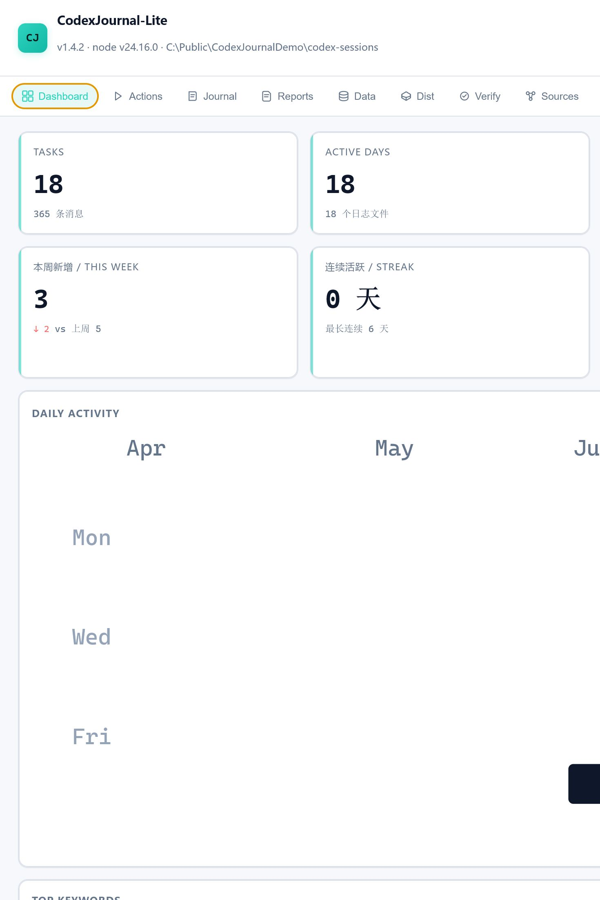
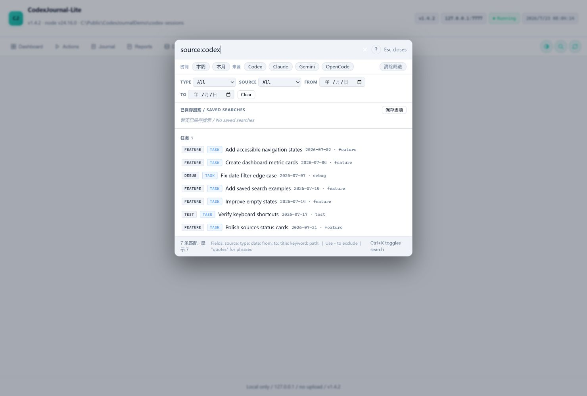
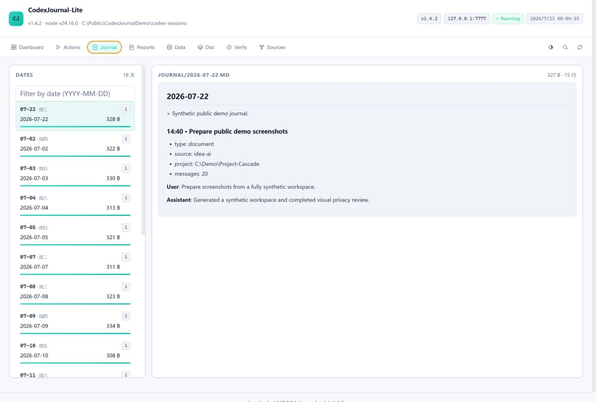
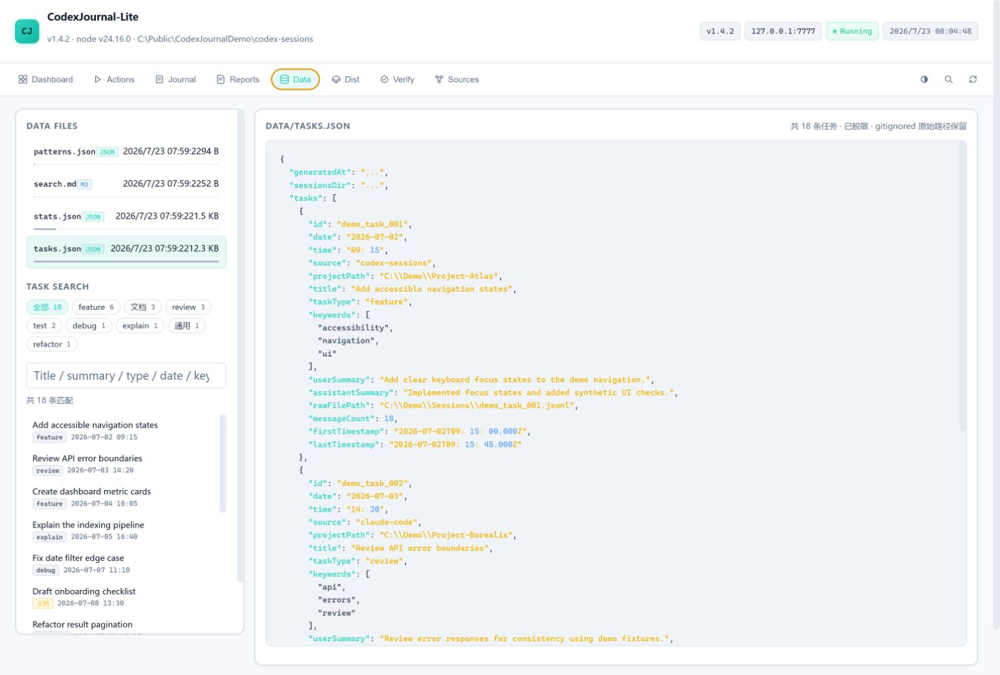
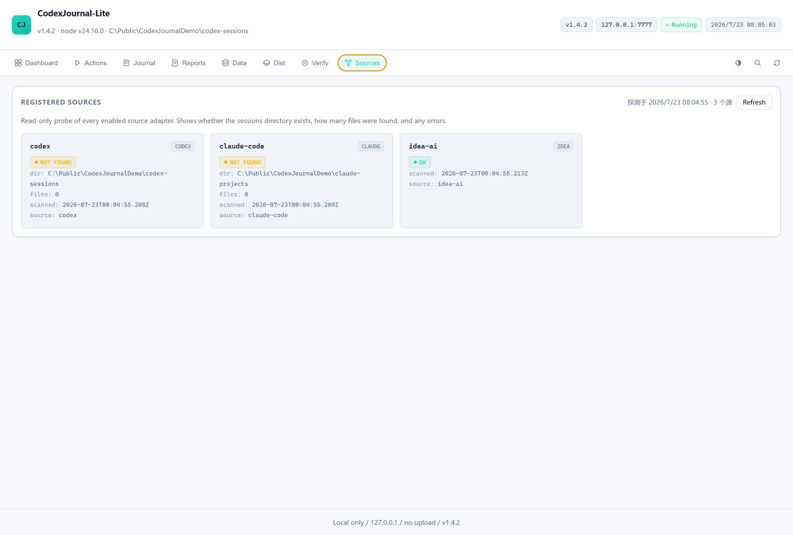

# CodexJournal-Lite

[](https://npmjs.com/package/codexjournal-lite)
[](https://github.com/jiezeng2004-design/CodexJournal-Lite/actions/workflows/ci.yml)
[](.github/workflows/ci.yml)
[](LICENSE)
[](package.json)
[](package.json)

> **Stop losing useful decisions inside hundreds of AI coding sessions.**
>
> CodexJournal-Lite turns local Codex, Claude Code, Gemini CLI, OpenCode and JetBrains session logs into a searchable private work memory.

Everything stays on your machine. No upload. No telemetry. No third-party npm dependencies.

## The problem

AI coding assistants generate a lot of valuable context:

- why a bug was fixed a certain way;
- which approach was rejected;
- what changed before a release;
- which project or file a session belonged to;
- whether you already explored the same idea last week.

But that context usually stays scattered across tool-specific local logs.

CodexJournal-Lite turns those logs into:

```text
Codex / Claude Code / Gemini CLI / OpenCode / JetBrains
                         ↓
                 CodexJournal-Lite
                         ↓
        journal + tasks + search + reports
                         ↓
              localhost dashboard
```

## Quick start

Run once without installing:

```bash
npx codexjournal-lite
```

Or install globally:

```bash
npm install -g codexjournal-lite
codexjournal-lite
```

The tool reads enabled local session sources and writes outputs into your current workspace.

## What you get

- daily Markdown journals under `journal/`;
- structured task records under `data/tasks.json`;
- a local full-text search index;
- work-pattern, monthly and yearly reports;
- a localhost dashboard at `http://127.0.0.1:7777/`;
- source diagnostics so you can see which assistants were discovered and parsed;
- offline fixture tests for the supported adapters.

## Supported sources

| Source | Default location | Default state | Coverage |
| --- | --- | --- | --- |
| Codex | `~/.codex/sessions` | Enabled | Full archive |
| Claude Code | `~/.claude/projects` | Enabled | Full archive |
| JetBrains | platform config directory | Enabled | Inventory probe |
| Gemini CLI | `~/.gemini/tmp` | Disabled | Full archive |
| OpenCode | local OpenCode data directory | Disabled | CLI / file mode |

Enable, disable or override sources in `config.json -> sources[]`.

See [docs/sources.md](docs/sources.md) for per-source details.

## Screenshots

| Dashboard | Search |
| --- | --- |
|  |  |

| Journal | Tasks |
| --- | --- |
|  |  |

| Source diagnostics |
| --- |
|  |

The screenshots use a synthetic public-demo workspace.

## Real use cases

### Find an old debugging decision

Instead of rediscovering the same root cause, search the journal for the earlier session where the bug was investigated.

### Review a release

Scan recent sessions across multiple assistants to reconstruct what features, fixes and refactors were discussed before shipping.

### Keep context across projects

Point different journal workspaces at different session sources so unrelated projects do not become one giant archive.

### Avoid repeated exploration

Search questions like:

```text
Did I already try approach X for problem Y?
```

across weeks of local coding sessions.

## Privacy model

CodexJournal-Lite is designed for local developer memory, so privacy is part of the product boundary:

- no telemetry;
- no upload;
- no network calls for archive, analysis, verification or dashboard use;
- no external npm runtime dependencies;
- generated personal outputs are gitignored by default;
- local fingerprint caches should never be committed.

See [docs/privacy.md](docs/privacy.md) for the detailed privacy contract.

## Where outputs go

When run through `npx` or a global install, outputs are created under the **current working directory**, not inside the npm package.

Typical layout:

```text
data/
journal/
reports/
```

Override the workspace root with:

```text
--root <path>
```

or:

```text
CODEXJOURNAL_ROOT
```

## Fresh clone verification

```bash
git clone https://github.com/jiezeng2004-design/CodexJournal-Lite.git
cd CodexJournal-Lite
npm run verify:fresh
```

There are no npm dependencies to install. The project uses Node.js built-ins only.

## Common commands

```bash
npx codexjournal-lite
npx codexjournal-lite archive
npx codexjournal-lite --help
```

After a global install, the shorthand command is also available:

```bash
codexjournal
```

## Why this is intentionally lightweight

CodexJournal-Lite is not trying to become another cloud knowledge base.

It solves a narrower problem:

> **Make your existing local AI coding history searchable and inspectable without sending it somewhere else.**

That is why it favors plain Markdown / JSON, localhost UI, zero dependencies and explicit local files over hosted sync or proprietary storage.

## What it is not

- not a cloud memory service;
- not a replacement for the coding assistants themselves;
- not a telemetry collector;
- not an automatic “perfect summary” of every session;
- not a cross-user analytics platform.

## Documentation

- [Usage guide](docs/usage.md)
- [Source adapters](docs/sources.md)
- [Privacy contract](docs/privacy.md)
- [Project summary](docs/project-summary.md)

## Requirements

- Node.js 18+
- at least one supported local AI coding session source, or a custom path

## License

MIT. See [LICENSE](LICENSE).